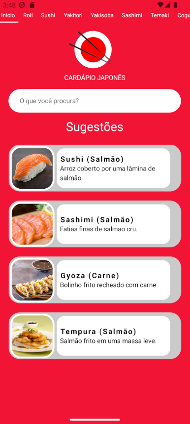

# 🍣 Cardápio de Restaurante Japonês

Este é um projeto desenvolvido com React Native como parte da **Missão 12** da plataforma DevMedia. O objetivo foi criar um app de cardápio japonês com filtros por categoria e componentes reutilizáveis.

---

## 📱 Preview



---

## 📌 Funcionalidades

- ✅ Lista de pratos com **imagem, nome e descrição**
- ✅ Filtro por categoria usando abas superiores
- ✅ Uso de componentes reutilizáveis (`ItemCardapio`)
- ✅ Estilização visual com `StyleSheet` e cores customizadas
- ✅ Integração com FlatList e parâmetros de navegação (`initialParams`)

---

## 🧩 Estrutura do Projeto

```bash
.
├── App.js
├── components
│   ├── inicio/
│   ├── categoria/
│   ├── itemCardapio/
│   │   ├── index.jsx
│   │   └── styles.js
├── dados/
│   └── cardapio.js
├── utils/
│   └── screenOptions.js
├── assets/
│   └── (imagens usadas no app)
```

---

## 🚀 Tecnologias Utilizadas

- React Native + Expo
- `@react-navigation/material-top-tabs`
- `react-native-gesture-handler`
- `react-native-tab-view`
- `StyleSheet` e `Dimensions` para responsividade

---

## 🧠 Conceitos Aplicados

- Componente genérico `ItemCardapio` com props dinâmicas
- Uso de `map()` para renderização condicional
- Navegação por **abas superiores com parâmetros**
- Organização de estilos externos para melhor manutenção
- Exibição responsiva de cards com `resizeMode='cover'`

---

## 📦 Instalação

```bash
npm install
npx expo install react-native-screens react-native-safe-area-context react-native-gesture-handler react-native-reanimated react-native-pager-view
npm install @react-navigation/native @react-navigation/material-top-tabs react-native-tab-view
```

---

## ▶️ Execução

```bash
npx expo start
```

---

## 🎯 Missão 12 (DevMedia)

Este projeto faz parte do módulo:

- **Curso**: React Native - `Array.map()` e `Array.filter()`
- **Projeto prático**: Construção de um cardápio de restaurante japonês

---

## 📃 Licença

Este projeto é educacional e foi desenvolvido exclusivamente para fins de aprendizado com base nas instruções da [DevMedia](https://www.devmedia.com.br/).

---

## 💡 Créditos

Projeto feito por Taís Guimarães para a trilha **React Native**
